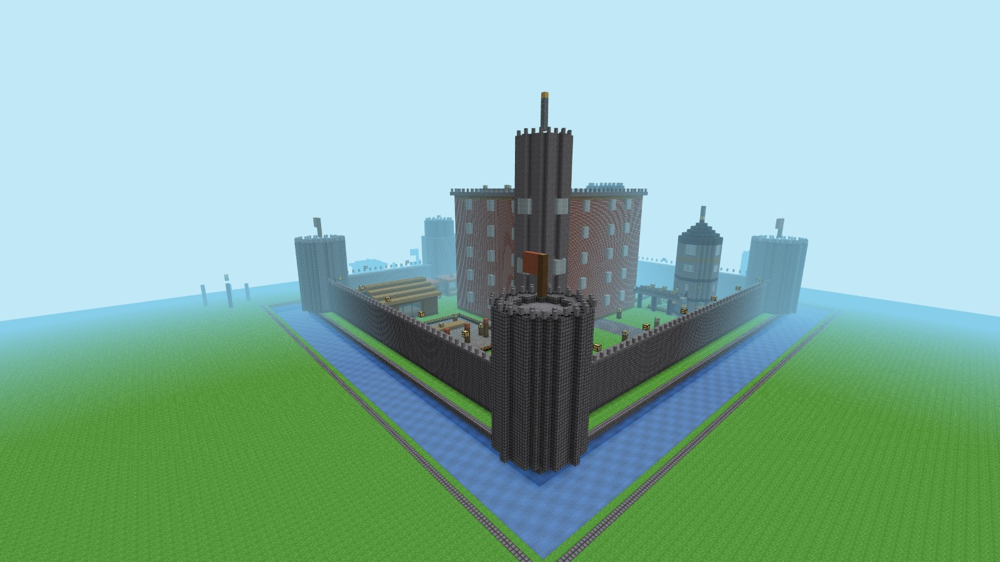

# Voxel Realm

A browser voxel sandbox engine built from scratch in TypeScript + Three.js. Streamed chunks, greedy meshing with vertex ambient occlusion, day/night and weather cycles, flowing water, procedural audio, critters, and a full in-game builder with blueprints — in ~18k lines with two runtime dependencies.

**[▶ Play it in your browser](https://edgar1738.github.io/voxel-realm/)** — or jump straight into a [ruined fortress kingdom](https://edgar1738.github.io/voxel-realm/?world=citadel).



## Quick start

Requires Node `^20.19` or `>=22.12`.

```bash
npm install
npm run dev        # http://localhost:5173
```

Open the URL, click to lock the pointer, and you're in.

## Features

- **Streaming voxel world** — chunk generation and meshing on frame budgets, adaptive view distance that grows toward 60 fps, burst mode for fast cold starts
- **Greedy meshing + vertex AO** — merged quads, per-vertex ambient occlusion, cross-chunk light propagation
- **Shaped blocks** — stairs (including upside-down), slabs (top/bottom), fences and gates with real collision boxes
- **Atmosphere** — day/night celestial sky, rain/snow/storms with lightning, plant sway, water shimmer, underwater fog and audio, headlamp for caves
- **Simulation** — flowing water and falling sand on a budgeted block ticker; birds, fish, and rabbits
- **Audio & feel** — procedural Minecraft-style sounds (no audio assets), break particles, movement sounds
- **Builder tools** — hotbar + creative inventory with rendered block icons, fill/clear/replace/copy region tools, paste ghost with rotate/mirror/array, dig tools with hold-to-repeat, undo/redo
- **Blueprints** — capture builds as reusable prefabs, categorized catalog with real thumbnails, curated set included
- **Persistence** — worlds saved to IndexedDB, or to disk (`.saves/`) through the dev server so saves can be shared and version-controlled
- **Play & build modes** — explore-first play mode with intro panel and guided tour, full creative build mode

## Controls

| Input | Action |
|---|---|
| `WASD` / mouse | Move / look |
| `Space` / `Shift` | Up (jump) / down |
| `F` | Toggle fly |
| `B` | Toggle build / play mode |
| Left / right click | Break / place |
| `1–9`, mouse wheel | Hotbar slot |
| `I` | Creative inventory |
| `X` / `G` / `R` / `C` | Fill / clear / replace / copy region |
| `[` `]`, `M`, `+`/`-` | Rotate / mirror / array a paste |
| Arrows, `PgUp`/`PgDn`, `N` | Nudge a paste on X/Z, up/down, reset |
| `Z`, `Y` | Undo / redo |
| `Shift` + wheel | Adjust reach |
| `V` | Placement ghost |
| `L` | Headlamp |
| `T` | Guided tour (curated worlds) |
| `Esc` | Close / cancel |

## Worlds

The world is selected with URL query params:

- `?world=<preset>` — terrain preset: `default`, `flat`, `void`, `arena`, `amplified`, `islands`, `canyon`, `villages`, `caverns`, `frontier`, `citadel`
- `?save=<name>` — named save; loads from `.saves/<name>` via the dev server (an existing save remembers its own preset)
- `?spawn=x,y,z` and `?look=yaw,pitch` — spawn overrides

Example — a ruined fortress kingdom:

```
http://localhost:5173/?world=citadel
```

Curated showcase saves built inside the engine live in `.saves/` (not committed): a medieval village, a walkable castle, a moated citadel, a coastal harbor, the Roman Colosseum, the Pyramids of Giza, and Denver's Washington Park rebuilt from real OpenStreetMap geometry.

```bash
npm run world:archive    # archive a save
npm run world:restore    # restore an archived save
npm run world:package    # package a world for sharing
```

## Dev API

The dev build exposes `window.__vr` in the console — pose the camera, roam a route, build with shape helpers (box, ring, octagon, cone), toggle AO/fog/headlamp, run headless reachability checks, and capture screenshots to disk. Start with:

```js
__vr.help()
```

## Development

```bash
npm test           # vitest — 1200+ tests, headless (fake-indexeddb, no GPU needed)
npm run lint       # eslint + prettier
npm run build      # tsc --noEmit && vite build
```

The engine logic (meshing, collision, lighting, worldgen, edits, persistence) is kept pure and covered by unit tests; CI runs on every push.

### Layout

```
src/
├── core/          coords, math, types, prefab format
├── blocks/        block registry, shapes, procedural textures
├── mesh/          greedy mesher, AO, shaped-block emitters
├── world/         chunk manager, lighting, block ticker
├── worldgen/      terrain presets, caves, ores, trees, structures, prefabs
├── edit/          edit service, brushes, voxel raycast
├── player/        controller, collision
├── render/        renderer, sky, weather, particles, critters, overlays
├── audio/         procedural sound engine
├── persistence/   IndexedDB + dev-server save stores
└── app/           Game composition root, input, UI, builder state, dev tools
```

## Authoring worlds

Building and publishing a curated world (build → save → add metadata → audit → package → share)
is documented in **[docs/authoring-worlds.md](docs/authoring-worlds.md)**.

## Shipped worlds (the front door)

The bare URL serves a world-select menu built from `world-manifest.json`: the curated showcase
collection plus create-a-world presets. Shipped worlds are static assets — `npm run world:bundle`
validates every manifest entry against its `.saves/<slug>.json` snapshot and writes a compact copy
to `public/worlds/<slug>.json`, which the production app fetches read-only and overlays with the
player's own edits (per-world IndexedDB). CI cross-checks the manifest against the bundled
snapshots (`tests/shippedWorlds.test.ts`), so a stale or missing bundle fails the build.

To ship a new world: author + package it (see the guide above), add it to the manifest with
`world:package --manifest`, then run `npm run world:bundle` and commit `world-manifest.json` +
`public/worlds/`.

## Deploying

Off-thread meshing (the P6 worker pool) requires the page to be **cross-origin isolated**, which
means the host must send `Cross-Origin-Opener-Policy: same-origin` and
`Cross-Origin-Embedder-Policy: require-corp` on the document. The dev server sets these
automatically; a production host must send the same headers to unlock `SharedArrayBuffer` and the
worker pool. Hosts that can't set custom headers (e.g. plain GitHub Pages) still work — the engine
detects the missing isolation via `MeshWorkerPool.supported()` and falls back to main-thread
meshing, so meshing runs on the render thread instead of workers.
